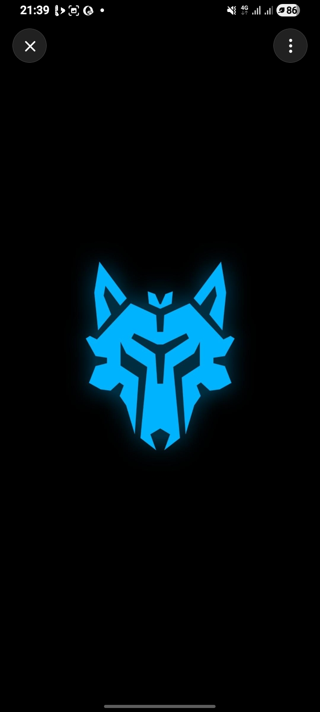

# AKIRA RAVEX - GAMEFORGE Mobile Gaming Platform & Crosshair Engine



**AKIRA RAVEX** is a high-performance Android mobile gaming companion app built with **Kotlin** and **Jetpack Compose**. It combines a real-time hardware telemetry dashboard (**GAMEFORGE**), a visual crosshair engine with **200+ unique presets**, floating HUD overlay services, background thermal guard protection, and local crash diagnostics (**RavexGuard**).

---

## 🌟 Key Features

1. **GAMEFORGE Dashboard**:
   - Real-time hardware telemetry monitoring (RAM usage, battery level, battery temperature, display refresh rate, network ping).
   - Real Installed Game Library: Automatically scans device packages and launches genuine installed games.
   - One-tap RAM Memory Cleaner & Task Optimizer.

2. **Ravex Crosshair Engine**:
   - Over **200+ unique crosshair presets** organized into Tactical FPS, Cyberpunk, Minimalist, and Dynamic categories.
   - **Ravex Studio Customizer**: Adjust shapes (Cross, Dot, Circle Cross, Chevron, T-Shape, Diamond, etc.), size, stroke width, gap, opacity, color, and animated pulse effects.
   - Per-game crosshair profile persistence using local preferences.

3. **Floating RAVEX HUD Overlay**:
   - System alert window overlay (`SYSTEM_ALERT_WINDOW`) presenting real-time FPS, RAM %, temperature (°C), and ping during live gameplay.
   - Draggable & expandable/collapsible tactical badge UI.

4. **Thermal Guard Protection**:
   - Foreground service monitoring battery and thermal status in the background.
   - Multi-stage temperature warnings (Normal <36°C, Warm 36-42°C, Overheat >42°C) to prevent system throttling.

5. **Ravex Network Boost**:
   - Latency monitor and ping stabilization utility with socket flushing.

6. **RavexGuard Diagnostic**:
   - Uncaught exception handler logging local crash diagnostics for stability analysis.

---

## 🛠️ Tech Stack & Architecture

- **Language**: Kotlin 1.9.22
- **UI Framework**: Jetpack Compose (Material3, Canvas Drawing Engine)
- **Min SDK**: 26 (Android 8.0)
- **Target SDK**: 34 (Android 14)
- **Build System**: Gradle 8.8 with Kotlin DSL
- **Services**: Foreground Services (`FOREGROUND_SERVICE_SPECIAL_USE`), WindowManager Floating Overlays
- **Architecture**: Jetpack Compose Clean UI State + Repository pattern

---

## 🚀 Building & Running

### Prerequisites
- JDK 17 or JDK 21
- Android SDK (API Level 34)

### Build Debug APK
```bash
./gradlew assembleDebug
```
The compiled APK will be located at `app/build/outputs/apk/debug/app-debug.apk`.

### Run Unit Tests
```bash
./gradlew test
```

---

## 🔒 Permissions & Safety Notice
AKIRA RAVEX is strictly a visual customizer HUD and hardware performance monitoring application. It does **not** perform memory injection, aimbot function, game code modification, or reverse engineering of any third-party games.
