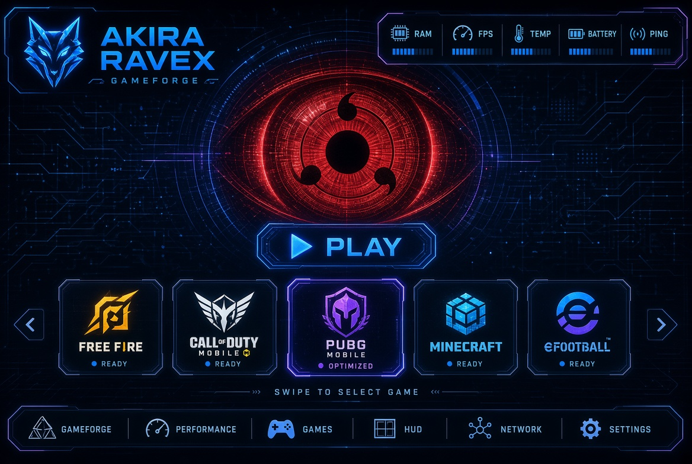

# AKIRA RAVEX - SHARINGAN UI GAMEFORGE Mobile Gaming Platform



**AKIRA RAVEX** is a high-performance native Android mobile gaming companion app and HUD platform built in **Kotlin** with **Jetpack Compose**. It reproduces the crimson **Sharingan UI** gaming interface in **Landscape Orientation**, featuring a live hardware telemetry header, 200+ preset visual crosshair engine, draggable floating RAVEX HUD bubble overlay with in-game crosshair controls, game-targeted crosshair assignment, Thermal Guard monitoring, and local crash diagnostics (**RavexGuard**).

---

## 🌟 Key Features & Requirements Compliance

1. **Sharingan UI & Landscape Orientation**:
   - Primary gaming interface designed for horizontal/landscape phone usage (`sensorLandscape`).
   - Features animated rotating 3-tomoe Sharingan Eye centerpiece, unobscured PLAY button directly underneath, tech panels, and glowing crimson telemetry bar.
   - **Sharingan Navigation Bar**: `[GAMEFORGE] [PERFORMANCE] [GAMES] [HUD] [NETWORK] [SETTINGS]`.

2. **GAMEFORGE Real Game Carousel & Targeted Crosshair**:
   - **Real Games Only**: Scans and displays installed Android applications using system `PackageManager`.
   - Uses real application icons and labels.
   - Launches genuine installed games using official Android launch intents.
   - **Per-Game Targeted Crosshairs**: Assign specific crosshair presets to target games that automatically activate on launch.

3. **Ravex Crosshair Engine (200+ Presets)**:
   - Over **200+ unique crosshair designs** (Tactical FPS, Cyberpunk, Minimal, Dynamic, and Custom).
   - **Studio Customizer**: Custom shapes (Cross, Dot, Circle Cross, Chevron, T-Shape, Diamond, etc.), size, stroke, gap, opacity, center dot, rotation, and animated pulse.
   - Strictly a visual customizer HUD (no aimbot, auto-aim, or game code modification).

4. **Floating RAVEX HUD Bubble Overlay with In-Game Controls**:
   - Smoothly draggable floating Sharingan/Wolf bubble window using Android `SYSTEM_ALERT_WINDOW` (`Settings.canDrawOverlays`).
   - Tap-to-expand HUD panel providing real-time FPS, RAM %, temperature, and ping.
   - **In-Game Crosshair Quick Settings**: Change crosshair presets, adjust size, opacity (70%+), and quick color choices directly from the floating HUD panel while playing games.

5. **Phone Health & Hardware Safety**:
   - Pure telemetry readout system for RAM, display refresh rate, battery temperature, battery voltage, and thermal state.
   - **Hardware Safety**: Does NOT overclock, undervolt, modify kernel settings, or tamper with device hardware.

6. **Thermal Guard & Network Boost**:
   - Multi-stage temperature warnings (Normal <36°C, Warm 36-42°C, Overheat >42°C) with background notifications.
   - Network latency monitoring and ping stabilization.

7. **RavexGuard Diagnostics**:
   - Local uncaught exception handler for logging local crash diagnostics.

---

## 🛠️ Tech Stack

- **Language**: Kotlin 1.9.22
- **UI Framework**: Jetpack Compose (Material 3 & Canvas Custom Drawing Engine)
- **Target SDK**: 34 (Android 14) / Min SDK: 26
- **Build System**: Gradle 8.8 with Kotlin DSL
- **Services**: WindowManager Floating Overlays & Foreground Services

---

## 📁 Compiled APK Binary
The compiled debug APK binary is committed directly in the repository at:
`apk/AKIRA-RAVEX-debug.apk`

### Rebuilding APK
```bash
./gradlew assembleDebug
```

### Running Unit Tests
```bash
./gradlew test
```

---

## 🔒 Security & Policy Notice
- **Visual Overlay Only**: RAVEX Crosshair is a visual canvas overlay. It does NOT automatically aim, track targets, detect enemy heads, modify game memory, or bypass game anti-cheat systems.
- **Read-Only Telemetry**: RAVEX Phone Health is a monitoring readout system. It does NOT overclock, undervolt, modify kernel settings, or alter device hardware.
